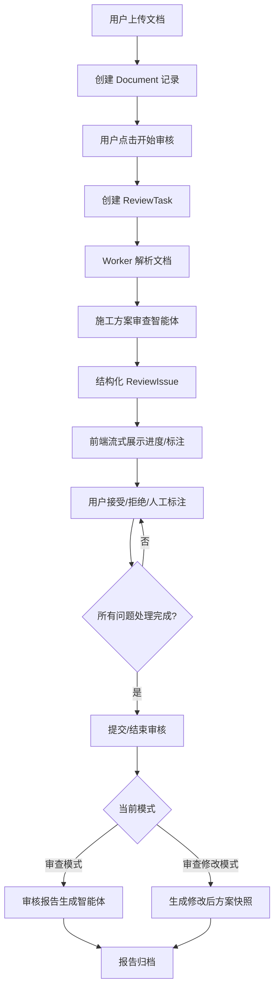

# 平台架构与开发方案

## 1. 总体架构

建议采用前后端分离架构：

- Frontend: React + TypeScript + Vite。
- Backend API: FastAPI 或 NestJS。
- Async Worker: Python Worker，负责文档解析、OCR、AI 审查、报告生成。
- Storage: PostgreSQL + MinIO/OSS。
- Cache/Queue: Redis + Celery/RQ/BullMQ。
- AI Orchestration: 初期可自研服务接口，后续接 Dify 或 LangGraph。
- Vector Store: 预留 Milvus、Qdrant、Chroma 或 pgvector。

## 2. 前端模块划分

```text
src/
  app/
    routes/
    layouts/
    providers/
  features/
    auth/
    documents/
    review-workbench/
    knowledge-base/
    data-assets/
    agents/
    prompt-assets/
    reports/
  shared/
    components/
    hooks/
    types/
    utils/
```

## 3. 页面路由建议

```text
/login
/app/documents
/app/documents/:documentId
/app/knowledge-base
/app/data-assets/agents
/app/data-assets/prompts
/app/reports/:reportId
```

## 4. 核心实体

### User

- id
- username
- displayName
- role: `super_admin | supervisor | contractor`
- organizationId

### Document

- id
- name
- projectName
- fileType
- fileUrl
- uploaderId
- status
- reviewMode
- createdAt
- updatedAt

### ReviewTask

- id
- documentId
- status
- progress
- currentStage
- startedAt
- finishedAt
- errorMessage

### ReviewIssue

沿用当前 Demo 模型，并扩展：

- id
- documentId
- source
- status
- severity
- anchor
- finding
- resolution
- confidence
- references

### Agent

- id
- name
- type
- promptId
- enabled
- roleScope
- createdAt

### PromptAsset

- id
- name
- type
- systemPrompt
- userTemplate
- outputSchema
- variables
- version
- enabled

### Report

- id
- documentId
- taskId
- reportType
- content
- fileUrl
- createdAt

## 5. 审查任务流



## 6. 异步与流式策略

推荐：

- 上传完成后创建任务。
- 前端进入详情页 loading 状态。
- 后端使用 SSE 推送阶段进度。
- 任务完成前禁止人工操作。
- 用户退出页面，任务继续执行。
- 用户再次进入文档详情页时恢复任务状态。

事件示例：

```json
{
  "taskId": "task-001",
  "type": "review.issue.created",
  "progress": 72,
  "payload": {
    "issueId": "ISSUE-001"
  }
}
```

## 7. 智能体接入策略

### 初期

- 使用本地 mock service。
- 前端保留智能体配置 UI。
- 输出使用固定 JSON。

### 中期

- 接入 Dify Workflow 或自研 FastAPI agent service。
- 知识库上下文通过 API 注入。
- 结构化输出落库。

### 后期

- 对复杂 human-in-the-loop 流程接入 LangGraph。
- 审查任务、人工决策、报告生成形成可恢复状态图。

## 8. 技术选型建议

### 文档渲染

- PDF: PDF.js + react-pdf-highlighter 系列。
- DOCX: OnlyOffice 或后端转 PDF/HTML 后审阅。
- MVP: 继续 HTML mock。

### 文档解析

- MinerU：适合复杂 PDF、表格、版式。
- PyMuPDF/pdfplumber：适合坐标提取和轻量解析。
- PaddleOCR：扫描件/图片 OCR。

### 报告生成

- 初期：HTML/Markdown 报告预览。
- 中期：后端生成 PDF/Word。
- 台账：Excel 导出。

## 9. 权限策略

权限不只控制菜单，还要控制模式：

| 角色 | 文档库 | 审查模式 | 审查修改模式 | 报告生成 | 数据资产 |
|---|---|---|---|---|---|
| 超管 | 是 | 是 | 是 | 是 | 是 |
| 监理 | 是 | 是 | 否 | 是 | 否 |
| 施工方 | 是 | 否 | 是 | 否 | 否 |

## 10. 开发规范

项目级开发标准请统一参考 [development-standards.md](./development-standards.md)。后续所有前后端实现、接口调整、状态机变化、主题系统改动和安全约束更新，都应先对齐该文档，再进入具体实现。

## 11. 下一阶段推荐任务组

### Task Group A: App Shell

- 登录页。
- 角色 mock。
- 左侧导航。
- 文档库默认页。
- 知识库占位页。
- 数据资产占位页。

### Task Group B: Document Library

- 文档列表。
- 上传/拖拽区。
- 审查状态。
- 点击进入详情页。

### Task Group C: Agent Assets

- 智能体列表。
- 智能体详情。
- 提示词资产列表。
- 提示词编辑表单。

### Task Group D: Review Task Mock

- 上传后创建任务。
- 详情页 loading。
- mock 流式进度。
- 完成后进入当前审查工作台。

### Task Group E: Report Mock

- 所有问题处理后启用提交。
- 审查模式生成 mock 报告。
- 审查修改模式生成修改后方案快照。
